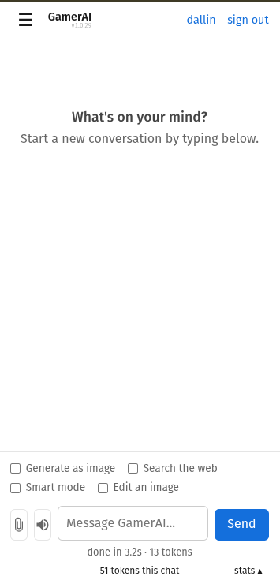

# GamerAI

> **A community-powered AI suite — chat, images, and web-augmented answers —
> where contributing a gaming PC earns you tier-based access for yourself and
> the people you invite.**

**[Try it now](https://ai.dallinlayton.com/demo)** — no account, no install,
just a chat box. Full access (bigger model, image generation, invites) needs
the [agent](https://ai.dallinlayton.com/download/), which is also how you
join: running it *is* signing up, no invite code required.

<p align="center">
  
</p>

This is a real, running distributed system, not a demo repo: a FastAPI
coordinator doing job routing and quota enforcement, a Redis-backed queue,
per-member auth with an invite graph, a Windows agent that self-updates with
signed releases, and — the part I'd point a reviewer at first — [smart
mode](docs/smart-mode.md), which splits a 14B-class model's layers across two
separate contributor machines over llama.cpp RPC so their combined VRAM runs
a model neither card could hold alone. `docs/project-gaps.md` is a maintained,
dated, severity-tagged list of what's still rough — the kind of doc I'd want
from anyone handing me a production system.

This repo is a fully local, containerized MVP. One command brings up a
coordinator, Redis queue, SQLite store, a web UI, and any number of worker
nodes that simulate contributor machines.

The MVP today serves **two tools** — chat and image generation — with the
architecture job-based and per-tool capability-routed (agents advertise
`tools=["chat","image"]` at registration; the coordinator queues each
job to the matching per-tool Redis queue and only image-capable workers
pick up image jobs). Web-augmented answers and additional tools are
additive on top of this same plumbing — see § 14 (Roadmap).

**Membership is contribute-to-use.** When you run the agent, your GPU serves
jobs from the network's shared queue anonymously — not just your own
invitees. A paid customer layer (Phase 3b+) funds bonus payouts to opt-in
contributors who serve paying users, but free contributors always get
priority. See § 5 (Economics).

```bash
docker compose up --build
# open http://localhost:8080
```

Live: https://ai.dallinlayton.com — see [`docs/devlog.md`](docs/devlog.md) for
deploy details, decisions, and operational runbook.

---

## 1. Product overview

GamerAI is a **community-powered AI suite** running on a network of
contributor gaming PCs. Three actors:

- **Contributors** install a small agent and advertise the tools their
  hardware can run (chat, image generation, web search, voice, eventually
  doc/code). When the machine is idle, the agent serves jobs from the network's
  **shared queue** — anonymously from the contributor's POV. In return,
  contributors get tier-based access to the network's full AI suite for
  themselves and the people they invite. Tier (BRONZE → PLATINUM) is
  earned by uptime + capability + actual jobs served, not paid for.
- **Invitees** are non-contributing friends, family, household members
  invited by a contributor. Their usage comes from the inviter's quota;
  the inviter sets their cap. Invitees do not need their own hardware.
- **Paid customers** (Phase 3b+, not MVP) — CASUAL households,
  DEVELOPER per-token API users, ENTERPRISE volume customers — pay for
  access. Paid revenue funds bonus payouts to opt-in PRO/PLATINUM
  contributors who serve paying jobs, and a capped share covers
  coordinator infrastructure.

**The coordinator** runs job routing, the tier engine, accounting, and
centralized helpers (e.g. web search). It is the only platform-owned
component; everything else (compute, data, models) lives on contributor
machines. The platform never extracts from contributors — paid revenue
only ever flows to bonus payouts + infra costs.

The network is fully **per-job and per-tool**: every completed job is
priced in its natural unit (tokens for chat, images for SDXL, requests
for search) and credited to the contributor's ledger.

### Tools

| Status   | Tool          | Model class            | Why it fits a distributed network |
| -------- | ------------- | ---------------------- | --------------------------------- |
| **MVP, live** | Chat          | 7B–13B (currently 3B for the default fleet) | Independent jobs, latency-tolerant, low VRAM |
| **MVP, live** | Smart-mode chat | 14B-class (Qwen2.5-14B Q4) split across two LAN-linked contributor machines via llama.cpp RPC | Pools VRAM no single contributor card has; slower, a capability class up — see [`docs/smart-mode.md`](docs/smart-mode.md) |
| **MVP, live** | Web-augmented answers | worker-side DDG fetch + chat model summary | No new VRAM needed, but ships as its own worker capability (`tools=["search"]`), not automatic on every chat worker |
| **MVP, live** | Image generation | SDXL-class (dreamshaperXL-lightning, ~6.5 GB VRAM) | Independent jobs, async-friendly, high demo wow |
| **MVP, live** | Voice (read-aloud TTS) | Piper, CPU-only | Runs alongside chat on the same contributor's idle CPU; no batch/STT yet — see below |
| Expansion | Document tools (summarize, rewrite, chunked analysis) | 7B–13B | High retention, same hardware envelope as chat |
| Expansion | Coding assistant | 7B–13B | Frequent, small jobs, plays to the chat envelope |
| Later    | Music generation (MusicGen) | varies | Async / queued; longer runtimes |
| Later    | Voice input (STT) | varies | Real-time voice deliberately out of scope |
| Out of scope | Tightly-coupled multi-node, real-time low-latency, frontier training | — | Network constraints make these unwise |

The principle behind the list: pick tools that are **independent, retryable,
and tolerant of moderate latency**, because that is the shape of jobs a
heterogeneous gamer network can serve well. See [`business.md`](business.md)
for the strategic framing.

## 2. Problem statement

Two facts about the AI market today:

1. **Centralized inference is expensive.** OpenAI, Anthropic, and the major
   cloud GPUs charge a premium that reflects scarcity, not marginal cost.
2. **Massive amounts of compute sit idle.** There are tens of millions of
   gaming PCs with capable GPUs that run at <5% utilization most of the day.

The gap between #1 and #2 is the opportunity.

## 3. Solution

A **contribute-to-use community network** with an optional paid layer:

- A **coordinator** that accepts jobs, queues them, dispatches to idle
  contributors, tracks per-member contribution + consumption, and
  enforces tier-based quotas. Eventually routes paid customer jobs to
  the opt-in pool.
- **Contributor agents** running on consumer hardware. They poll for
  jobs from the shared queue, run inference locally (Ollama / llama.cpp
  / vLLM), submit results, and earn tier-based access in return.
- **Members and invitees** that submit prompts via REST or a UI; in a
  future phase, paid customers do the same with separately metered
  access.

This MVP simulates the entire loop on a single host using Docker Compose.
Nothing in the architecture assumes a single host beyond the default
`host.docker.internal` URL workers use to reach Ollama.

## 4. Architecture

This diagram is the **local dev harness** you get from `docker compose up
--build` — Python `worker` containers simulate contributor machines. In
production the `worker` containers don't run at all; real contributors'
Windows agents (`windows-agent/`) talk to the same coordinator over the
public internet instead, polling `/jobs/next` and posting to
`/jobs/complete` exactly like the simulator does (see § 14 Phase 2 for how
that fleet is deployed).

```
                        ┌──────────────────────┐
   browser ──────▶      │     client (web)     │   FastAPI UI, port 8080
   $ python client.py   │  + CLI (host-side)   │
                        └──────────┬───────────┘
                                   │ REST
                                   ▼
                        ┌──────────────────────┐
                        │     coordinator      │   FastAPI, port 8000
                        │  ─ /generate         │
                        │  ─ /result/{id}      │     ┌────────────┐
                        │  ─ /workers          │ ──▶ │   SQLite   │  system of record
                        │  ─ /earnings         │     │  /data/*.db│
                        │  ─ /metrics          │     └────────────┘
                        │  ─ reaper thread     │
                        └──────────┬───────────┘
                                   │ rpush / hset / blpop
                                   ▼
                        ┌──────────────────────┐
                        │        redis         │   queue + claim deadlines
                        └──────────┬───────────┘
                                   ▲
        ┌──────────────────────────┼──────────────────────────┐
        │                          │                          │
   ┌────┴───┐                ┌────┴───┐                  ┌────┴───┐
   │ worker │                │ worker │                  │ worker │   --scale worker=N
   │  idle  │                │  busy  │                  │offline │
   └────┬───┘                └────┬───┘                  └────────┘
        └──────── Ollama (host.docker.internal:11434) ─────────┘
```

### Services

| service       | role                                                    | port |
| ------------- | ------------------------------------------------------- | ---- |
| `coordinator` | REST API, job dispatch, SQLite write-through, reaper    | 8000 |
| `redis`       | job queue, in-flight claims, fast worker registry       | 6379 |
| `worker`      | claims jobs, runs inference, simulates gamer realism    | —    |
| `client`      | minimal web UI + proxy to coordinator                   | 8080 |

### Storage layers

| store    | role                                                          |
| -------- | ------------------------------------------------------------- |
| Redis    | hot path: queue, in-flight claim deadlines, status, hot cache |
| SQLite   | system of record: jobs, workers, earnings (write-through)     |

The coordinator is the only writer to SQLite. Workers go through the
coordinator's `/jobs/claim` and `/jobs/complete` endpoints.

### Client = Progressive Web App

The chat UI ships as an installable PWA — manifest, icons, head tags
on every page (`client/templates/base.html.j2`), and a hand-rolled
service worker (`client/static/sw.js`) registered from root scope.

- **Install**: Android Chrome / Edge / Samsung fire the auto install
  prompt; iOS Safari 16.4+ uses Share → Add to Home Screen. The
  client JS captures `beforeinstallprompt` and shows a banner on
  Android; iOS gets a manual-instructions banner.
- **Offline shell**: the SW precaches every CSS, JS module, icon, and
  the offline fallback template at install. Navigations to uncached
  paths render `/offline` when the network is down.
- **Push notifications**: members opt in via a second banner shown
  only after install (per `PWA_REFERENCE.md` §8 — iOS requires it).
  The coordinator delivers a push on image / TTS job completion via
  `coordinator/notifications.send_to_member` → `pywebpush`. Requires
  a per-deployment VAPID keypair (see `infra/README.md`).

The JS is split into focused ES modules in `client/static/js/`:
`state.js` (shared mutable state), `readAloud.js` (TTS),
`messageRenderer.js` (DOM), `streamingEngine.js` (polling +
typewriter + retry), `composer.js` (tool toggles), `imageGallery.js`
(lightbox), `notifications.js` (Web Push subscribe hook),
`installPrompt.js` (PWA detection + banners), and `chat.js`
(orchestrator). `chat.html.j2` loads `chat.js` as `type="module"`;
the SW versions all of them together via a single `CACHE_VERSION`
constant that operators bump per release.

### Scheduler

Jobs are pulled (`BLPOP`) by workers — but workers only poll while their local
state is `idle` and they are within their availability window, so jobs are
naturally only claimed by idle workers. When a worker claims a job, the
coordinator records a deadline in Redis (`job_processing` hash). A background
**reaper thread** scans for expired deadlines and **requeues** the job so it
isn't lost if a worker disappears mid-job.

## 5. Economics

The economics are **three layers stacked**: free contributor-tier access
forms the foundation, an optional paid customer layer funds the
coordinator and bonus payouts, and PRO/PLATINUM contributors can opt
into earning from paid jobs.

### Layer 1 — Contribute compute, earn tiered access (MVP)

Contributing is free; access is tiered by what you actually contribute.

| Tier | Criteria (target) | Benefits |
|---|---|---|
| **BRONZE** | Agent installed, intermittent uptime | Full toolbox; small monthly quota; 1 invite slot |
| **SILVER** | ~4 hrs/day average uptime | 5× quota; 3 invites; queue priority over BRONZE |
| **GOLD** | ~12 hrs/day; multi-tool capable | 20× quota; 10 invites; eligible for paid-pool opt-in |
| **PLATINUM** | ~20+ hrs/day; high-VRAM card | Effectively unlimited; first dibs on new tools; full paid-pool participation |

Tier promotion is **uncapped meritocracy** and **low-friction**: anyone
with a 4090 and a 24/7 availability toggle can hit PLATINUM tier on day
one. The status loop should never feel gated.

**Paid-pool eligibility is decoupled from tier promotion.** The opt-in
toggle for serving paid customer jobs only appears after the agent has
demonstrated **1 week of sustained uptime + minimum claim rate**. Tier
gets you the status; reliability proof gets you the earnings.

Tier maintenance requires **both uptime AND actual jobs served** — an
agent that idles online while refusing jobs (a fork, for example) falls
down the ladder. The coordinator measures claimed-jobs-per-hour as the
source of truth.

### Layer 2 — Paid customer tiers (Phase 3b+; not MVP launch)

| Tier | Audience | Latency | Pricing shape |
|---|---|---|---|
| **CASUAL** | Households without a gaming PC | Realtime | Flat monthly fee, generous-but-capped quota |
| **DEVELOPER** | App builders | <30s realtime | Per-token API; ~$1.50/1M tokens (between Haiku $1.25/1M and self-hosted) |
| **BATCH** | Bulk workloads (embeddings, doc summarization, classification) | <24h | ~$0.75/1M tokens — scheduled into low-utilization windows |
| **ENTERPRISE** | Companies | SLA-defined | Volume contract + dedicated worker pool + privacy-tier routing |

**BATCH** is the supply-soak lever: when network utilization is low,
batch jobs fill the slack instead of requiring more advertising. AWS
Spot Instances as the proven analog (50–70% discount for time-flexible
work; most enterprise AI workloads are batch-friendly).

Paid customer demand is served from a **separate priority queue** that
only contributors at GOLD+ who **opt in** can see. Free contributor
tiers are never degraded by paid demand — if paid demand exceeds opt-in
supply, paid customers see queue delays or capped service, not
contributors.

### Layer 3 — Bonus payouts to opt-in contributors

Paid revenue distribution:

```
80% → contributor who served the paid job (per-token payout)
20% → platform (coordinator infra + future development)
```

This **aligns incentives**: adding paid customers grows the prize pool,
which attracts more PLATINUM uptime, which grows total network
capacity, which benefits free contributors too. The platform never
extracts from contributor activity — only from paid activity, capped.

### Realistic earnings by GPU class

Honest numbers for what a contributor actually nets after electricity,
at US-median $0.16/kWh and the $1.50/1M-tokens × 80% split:

| GPU | Per 1M tokens (margin) | 1 hr/day active | 3 hr/day | 8 hr/day saturated |
|---|---:|---:|---:|---:|
| Basic (RTX 3060, 170 W, 30 tok/s) | $0.95 (79%) | $3/mo | $9/mo | **$24/mo** |
| Mid (RTX 4070, 200 W, 70 tok/s) | $1.07 (89%) | $8/mo | $22/mo | **$58/mo** |
| High (RTX 4090, 450 W, 100 tok/s) | $1.00 (83%) | $11/mo | $32/mo | **$87/mo** |

Per-token margin holds at 60–90% even on basic GPUs in expensive
electricity territory. But **idle overhead bites basic GPUs hard** — a
3060 left loaded 24/7 burns ~$3.50/mo in idle power, which can wipe a
light-demand month. The demand-driven uptime signal (see § 14 Phase
3b.ii) is load-bearing for basic-GPU profitability, not optional.

Practical framing:
- **Basic-GPU pitch**: free AI for you + invitees; near-zero power cost
  when demand is low; occasional Netflix-sub bonus when network is busy.
- **High-end-GPU pitch**: real secondary income at saturation
  (~$80–90/mo even in California), plus community status.

### Sustainability target

Coordinator infra: ~€8/month today; ~$50/month at 1k users; ~$200/month
at 10k users. Break-even at the $1.50/1M DEVELOPER tier:

- $50/month coordinator = 33M tokens/month of paid usage
- 33M tokens at 50 tok/s = ~6 hours/day of one PLATINUM contributor in
  the paid pool

Translation: **two paying developer customers + one PLATINUM
contributor covers the founder's coordinator bill indefinitely.** A
year-one milestone, not a unicorn target — the explicit answer to "how
does the founder stop self-hosting at a loss."

## 6. Contributor value proposition

Why someone runs the agent on their gaming PC. The dial that controls
each of these is **uptime + capability + jobs served** (i.e. your tier):

- **Be the host.** You're the person who runs AI for your household,
  friend group, D&D group, coworking space — whoever you invite.
- **Your own access** to the full toolbox, tiered by what you
  contribute. PLATINUM contributors effectively never hit their cap.
- **Status that compounds.** Tier badges on the leaderboard; first
  access to new tools as they ship; longer Ollama keep-alive windows so
  your latency stays low.
- **Opt-in paid-pool bonuses at GOLD+.** Earn per-token payouts on paid
  customer jobs you serve. Power consumption scales with paid demand,
  and so do the payouts — power bill and bonus are correlated, not
  decoupled.
- **No exclusivity.** Leave the network at any time; in-flight jobs are
  automatically requeued by the reaper. Your tier drops over time if
  you stop contributing, but rejoining is one-click.

**Power draw scales with demand, not uptime.** A contributor's marginal
power cost: ~0 W when no jobs are arriving, ~30 W during the Ollama
keep-alive window after a recent job, ~250–400 W during active
inference. Leaving the agent online overnight on a quiet network costs
near-zero; bursts of real power happen when there are real users (and,
at GOLD+, real payouts).

## 7. User experience

Two distinct audiences, both reaching the same coordinator:

### For contributors and their invitees (the default audience)

- **No subscription.** You're already paying with idle GPU cycles.
- **Prompts handled by community-contributed GPUs**, not OpenAI's or
  Anthropic's data centers. Your data is not used to train anyone's
  model.
- **Full toolbox in one place** — chat, image, search, and whatever
  ships next, behind a unified UI.

> **Privacy framing — honest version.** Under the membership rule, your
> prompts traverse the contributor network (not the public internet,
> not a hyperscaler) but they do flow through random contributors'
> GPUs, not specifically your inviter's machine. For sensitive
> prompts, the Phase 5 client-side embedding tier removes raw text
> from the wire — that's the answer to "is this private *enough*."

### For paid customers (Phase 3b+)

- **Undercut Anthropic Haiku on price** — gaming-PC supply is
  structurally cheaper than data-center supply.
- **Async-friendly API**, no rate limits beyond the size of the opt-in
  PRO/PLATINUM pool.
- **Opt-in privacy-tier routing** for enterprise: pin jobs to vetted
  worker pools, client-side embedding for the strictest cases.

## 8. Limitations (honest)

This is an MVP. Don't ship it to customers as-is.

- **Higher latency than centralized providers.** Cold-start and network
  delays are simulated for realism — they're real on consumer hardware.
- **Lower reliability than a hyperscaler.** No multi-region failover, no
  durable replication, no SLO. Workers can disappear mid-job (handled by
  requeue, but customers see latency spikes).
- **No batching.** One prompt per request. Real systems batch aggressively.
- **No billing.** Auth is wired (per-member u/p sign-in + invite flow +
  agent pairing — see `docs/auth-design.md`), but the paid-customer
  ledger is Phase 3b.ii. Today everything past sign-up is free for
  contributors and their invitees.
- **Token counts are approximated** when Ollama doesn't report them
  (`len(text) // 4`). Production would use the model's actual tokenizer.
- **No proof-of-work.** The MVP trusts workers to report honest output and
  honest token counts. A real network needs result verification (consensus,
  challenge-response, watermarking).
- **Local-only.** No TLS, no public ingress, no cloud yet.

## 9. Local setup

### Prerequisites

- Docker Desktop (Mac/Windows) or Docker Engine + Compose plugin (Linux).
- Optional: [Ollama](https://ollama.com) on the host. Without it, run in
  mock mode — see below.

### Run with real inference (Ollama)

```bash
# on the host
ollama serve &
ollama pull llama3.2:1b

# from this repo
docker compose up --build
```

Switch model: `MODEL=mistral docker compose up --build`.

### Run without Ollama (mock mode)

```bash
MOCK_INFERENCE=true docker compose up --build
```

### Run without Docker at all

For quick UI iteration without a Docker install: `tools/run_local.py`
runs the coordinator, client, and a mock worker in one Python process
against an in-memory fake Redis — same venv used for tests, no Redis or
Ollama needed.

```bash
.venv/bin/python tools/run_local.py
# open http://localhost:8080
```

### Scale workers

```bash
docker compose up --build --scale worker=3
```

Each worker registers with a unique ID and shows up in `GET /workers`.

### Try it

**Web UI:** open <http://localhost:8080>.

**CLI:**

```bash
python client/client.py "Explain GPUs simply"
python client/client.py --workers
python client/client.py --earnings
python client/client.py --metrics
python client/client.py --result <job_id>
```

**curl:**

```bash
curl -X POST http://localhost:8000/generate \
  -H "Content-Type: application/json" \
  -d '{"prompt": "Explain GPUs simply"}'
# => {"job_id":"…"}

curl http://localhost:8000/result/<job_id>
curl http://localhost:8000/workers
curl http://localhost:8000/earnings
curl http://localhost:8000/metrics
```

### Production deploy (MVP test)

To stand up a public coordinator that real gamer machines can connect to,
spin up an Ubuntu VPS (Hetzner CPX21 ~€8/mo works), point a domain at it,
and run the one-shot installer:

```bash
curl -sSL https://raw.githubusercontent.com/Hyrumdrums/GamerAI/main/infra/bootstrap.sh \
  | sudo bash -s -- --domain coordinator.example.com --email you@example.com
```

The script installs Docker, configures `ufw`, clones the repo, generates an
`API_TOKEN`, and brings up the stack with Caddy in front of it
(automatic Let's Encrypt TLS). Total time: ~10 minutes.

See `infra/README.md` for the full runbook including auth-on procedure,
backups, and graduation criteria for moving to Terraform / AWS.

## 10. API

The coordinator exposes ~65 routes total; this table curates the ones an
external integrator actually needs. For everything else (invites,
conversations, notifications, document uploads, agent pairing, machine
management, admin) — the full list is one grep away:
`grep -n '@app\.\|@router\.' coordinator/main.py coordinator/api_keys.py
coordinator/openai_compat.py coordinator/notifications.py
coordinator/uploads.py`.

**Job lifecycle**

| method | path                       | description                                           |
| ------ | -------------------------- | ----------------------------------------------------- |
| POST   | `/generate`                | `{prompt, model?, tool?}` → `{job_id}`. `tool` is `chat` (default) / `image` / `search` / `tts`. Optional `Idempotency-Key` header makes retries safe. |
| GET    | `/result/{job_id}`         | result JSON (status: `pending`/`running`/`complete`/`error`) |
| GET    | `/images/{name}`           | serves a generated PNG                                |
| GET    | `/models`                  | catalog of known models + strict-mode flag           |
| GET    | `/health`                  | redis ping                                            |

**OpenAI-compatible surface** (`coordinator/openai_compat.py`) — for any
tool that already speaks the OpenAI API (Home Assistant, Open WebUI, the
`openai` SDK directly), not just GamerAI's own web client:

| method | path                       | description                                           |
| ------ | -------------------------- | ----------------------------------------------------- |
| POST   | `/v1/chat/completions`     | OpenAI-shaped chat completion; `stream: true` for SSE. Wraps `/generate` + `/result` internally — same quota/auth. |
| GET    | `/v1/models`               | chat-kind models only, in OpenAI's `{"object":"list","data":[...]}` shape |

**Membership** — `/login` and `/signup` are the public entry points;
everything else below requires the `Authorization: Bearer <token>` they
return, once `API_TOKEN` is set (see § 11):

| method | path                       | description                                           |
| ------ | -------------------------- | ----------------------------------------------------- |
| POST   | `/login` / `/signup`       | username+password sign-in / invite-free account creation |
| GET    | `/me`                      | identity, tier, quota, usage-today, earnings          |
| POST   | `/me/api-keys`             | mint a self-serve API key (generation-scoped, `gai_api_…`) |
| GET    | `/me/api-keys`             | list your keys (label, created/last-used — never the raw value) |
| POST   | `/me/api-keys/{id}/revoke` | revoke one of your keys                                |

**Worker/agent protocol** — the Windows agent's own long-poll loop; not
meant for external callers:

| method | path                       | description                                           |
| ------ | -------------------------- | ----------------------------------------------------- |
| POST   | `/register`                | worker self-registration; optional `capabilities` body (`vram_gb`, `gpu_model`, `tools[]`, `models[]`) |
| POST   | `/heartbeat`               | worker liveness + status (`idle`/`busy`/`offline`)   |
| POST   | `/jobs/next`               | long-poll claim of the next queued job for this worker's advertised tools |
| POST   | `/jobs/complete`           | worker submits result; coordinator credits earnings   |
| GET    | `/workers`                 | list of workers + status, last_seen, totals, capabilities |
| GET    | `/earnings`, `/earnings/{worker_id}` | per-worker earnings                         |

## 11. Configuration

All services read from environment variables (see `shared/config.py`).

| var                       | default                          | service     |
| ------------------------- | -------------------------------- | ----------- |
| `REDIS_URL`               | `redis://redis:6379/0`           | all         |
| `DB_PATH`                 | `/data/gamerai.db`               | coordinator |
| `JOB_TIMEOUT_SECONDS`     | `120`                            | coordinator |
| `WORKER_TIMEOUT_SECONDS`  | `15`                             | coordinator |
| `COORDINATOR_URL`         | `http://coordinator:8000`        | worker, client |
| `WORKER_ID`               | auto-generated                   | worker      |
| `MODEL`                   | `llama3.2:1b`                    | worker      |
| `OLLAMA_URL`              | `http://host.docker.internal:11434` | worker   |
| `MOCK_INFERENCE`          | `false`                          | worker      |
| `AVAILABILITY_WINDOW`     | `always` (or `HH-HH` UTC)        | worker      |
| `NETWORK_DELAY_MIN/MAX`   | `0.5` / `3.0` seconds            | worker      |
| `COLD_START_MIN/MAX`      | `2.0` / `8.0` seconds            | worker      |
| `RATE_PER_TOKEN`          | `0.000005`                       | platform    |
| `WORKER_SHARE`            | `0.7`                            | platform    |
| `API_TOKEN`               | _unset_ (auth disabled)          | all         |
| `RATE_LIMIT_PER_MIN`      | `0` (disabled)                   | coordinator |
| `MAX_PROMPT_BYTES`        | `0` (disabled)                   | coordinator |
| `CAPACITY_JOBS_PER_WORKER` | `0` (disabled, unbounded queueing) | coordinator |
| `SIGNUP_MAX_PER_IP`       | `5` per `SIGNUP_WINDOW_SECONDS`   | coordinator |
| `SIGNUP_WINDOW_SECONDS`   | `3600` (1h)                       | coordinator |
| `IDEMPOTENCY_TTL_SECONDS` | `86400`                          | coordinator |
| `STRICT_MODELS`           | `false` (any model name accepted) | coordinator |
| `SMART_MODEL`             | _unset_ (registry default `qwen2.5:14b`) | coordinator |

## 12. Project structure

```
.
├── coordinator/           FastAPI app: job routing, membership/tier
│   │                      engine, SQLite write-through, reaper
│   ├── main.py              ~65 routes — auth middleware, /generate,
│   │                        /result, invites, conversations, admin
│   ├── api_keys.py          self-serve API keys (§ 14 Phase 2b)
│   ├── openai_compat.py     OpenAI-compatible /v1/chat/completions, /v1/models
│   ├── db.py
│   ├── tier_engine.py       nightly BRONZE → PLATINUM promotion/demotion
│   ├── model_registry.py
│   ├── requirements.txt
│   └── Dockerfile
├── windows-agent/         the real contributor fleet — production
│   │                      worker, not the local-dev simulator below;
│   │                      self-updates via signed releases (§ 14 Phase 2a)
│   └── agent.py
├── worker/                local-dev worker simulator (gamer realism sim
│                          — network delay, cold start, availability)
├── client/                FastAPI web UI + installable PWA
│   ├── app.py               route registration; see `client/routes/*`
│   ├── routes/, services/, templates/, static/
│   ├── client.py            ← `python client/client.py "prompt"` (CLI)
│   ├── requirements.txt
│   └── Dockerfile
├── shared/                shared schemas + config
│   ├── config.py
│   └── models.py
├── infra/                 VPS bootstrap + redeploy scripts, Caddyfile,
│                          contributor download-mirror setup scripts
├── docs/                  runbooks (`OPERATOR.md`), `project-gaps.md`,
│                          `auth-design.md`, `smart-mode.md`, devlog
├── tests/                 unittest suite — `python -m unittest discover tests`
├── tools/                 dev-only helpers (`run_local.py` no-Docker
│                          harness, `cchat.py` CLI chat client)
├── data/                  SQLite volume (gitignored)
├── docker-compose.yml
└── README.md
```

## 13. Observability

- **Structured JSON logs** from coordinator and worker include `service`,
  `worker_id`, `job_id`, and `event` fields. Pipe through `jq`:

  ```bash
  docker compose logs -f worker | jq 'select(.event == "complete")'
  ```

- **`GET /metrics`** returns counts and average latency in JSON, suitable
  for scraping into a dashboard.

## 14. Roadmap

### Phase 1 — local MVP (done)

- [x] Coordinator + Redis + workers running locally
- [x] SQLite write-through; per-job payout ledger
- [x] Reaper-based timeout requeue
- [x] Web UI + CLI client
- [x] Structured logs + `/metrics`
- [x] Simulated gamer realism (network delay, cold start, availability)

### Phase 2 — public deployment + real GPU nodes

**Phase 2a — single-VPS MVP test (done)**

- [x] One-shot VPS bootstrap script (`infra/bootstrap.sh`)
- [x] Caddy-fronted TLS via Let's Encrypt
- [x] Production docker-compose overlay; internal services on localhost only
- [x] `.env.prod` with generated `API_TOKEN` (auth-ready, opt-in)
- [x] Bearer-auth wired through worker + Windows agent code
- [x] Real worker installer with signed auto-update (Inno Setup installer, CI-built + SFTP-published on every push to `main`, Ed25519-signed self-update — not literally `curl | sh` since it targets Windows)
- [x] Connect real gamer machines and validate end-to-end loop — production fleet running on `ai.dallinlayton.com`

**Phase 2b — production AWS (after MVP signal)**

- [ ] Terraform under `infra/` (VPC, ECS Fargate, ElastiCache, RDS)
- [x] Self-serve API keys — contributor-scoped (`coordinator/api_keys.py`), spending the member's own free tier quota; not the paid-customer billing version this item originally meant
- [ ] Signed registration for workers (the Ed25519 signing that exists today is for agent *update binaries*, not `/register` calls)
- [ ] Move SQLite → Postgres / DynamoDB
- [ ] CloudWatch / OTLP log + metric ingestion
- [ ] Multi-region for latency to gamers

The VPS path keeps us shipping; Terraform comes when at least one of these
is true: 10+ active workers, real money flowing, multi-region latency
needs, or SQLite contention.

### Phase 3 — AI toolbox + community plumbing + paid layer

The strategic reframing: the platform is not a chat API, it's a *job-based
toolbox* of independent, retryable, latency-tolerant AI workloads served
by a contributor network. Phase 3 turns the chat-only MVP into a multi-
tool product, adds membership + tier infrastructure, then layers in the
optional paid customer revenue.

**Phase 3a — multi-tool foundations**

- [x] `tool` on `/generate` (`chat` | `image`) with an optional
      `image: {width, height, steps, seed, negative_prompt}` params
      block. Legacy `{prompt, model}` payloads keep working as
      implicit `tool=chat`. (Shipped 2026-05-20.)
- [x] Worker `capabilities.tools[]` registration; coordinator routes
      via per-tool Redis queues (`job_queue`, `job_queue:image`).
      Workers call `/jobs/next` with a `tool` field per tick and
      receive only matching jobs. (Shipped 2026-05-20.)
- [x] DB schema: `jobs.tool` column added; `messages.image_path`
      column for image attachments; `/data/images/<job_id>.png` for
      generated PNG storage; ownership-checked `/images/<name>`
      route. (Shipped 2026-05-20.)
- [x] Image-generation worker mode — Windows agent bootstraps
      `sd.exe` + `stable-diffusion.dll` + `sd1.5.gguf` from the
      mirror on first run, advertises `tools=["chat","image"]`, and
      runs `stable-diffusion.cpp` as a subprocess on image jobs.
      Returns PNG via base64 in `/jobs/complete`. (Shipped
      2026-05-21 end-to-end at agent v1.1.6.)
- [x] Unified "toolbox" UI — Chat/Image toggle in the existing chat
      composer (no separate route). Image messages render as inline
      `` bubbles via `/api/images/<name>` proxy. (Shipped
      2026-05-20.)
- [x] Web-search tool — ships as a worker-side capability
      (`tools=["search"]`), not centralized on the coordinator as
      originally planned here: the worker fetches DDG results itself
      (so the request comes from the contributor's IP, not the
      coordinator's) and prepends them to the prompt before calling
      its local chat model. See `docs/project-gaps.md`'s search-runway
      section for the full architecture.
- [x] SDXL-class imagery on the mirror — `dreamshaperXL-lightning`
      (SDXL-Lightning derived, ~6.5 GB) is the shipped default
      (`model_registry.py: DEFAULT_IMAGE_MODEL`). Plain base SDXL
      (non-Lightning) remains a stub for a future higher-quality/
      slower option.
- [ ] Per-image-job pricing — image earnings are flat-rated as
      ~200-token equivalents for MVP. Real per-image rates ship
      alongside paid-customer pricing in Phase 3b.ii.
- [ ] Image canaries — chat canaries cover model-swap detection
      for chat workers; image equivalent would need a known-good
      PNG fingerprint per prompt. Currently image worker outputs
      are trusted (PNG-magic + size cap only).

**Phase 3b — community plumbing first, paid layer second**

The strategic order: community/tier infrastructure ships before the
paid layer. Without tiers and invites, the paid pool has nothing to
opt into; without membership accounting, there's no fair way to gate
quotas.

**3b.i — Membership and tier engine**

- [x] Member token issuance (replaces the single shared API token).
      Tokens identify a contributor; coordinator records them on every
      job for tier accounting.
- [x] Per-member username + password sign-in (argon2 hashes,
      `POST /login`); invite redemption auto-creates the account and
      session — see `docs/auth-design.md`.
- [x] Agent browser-handoff pairing (`agent --pair` opens a confirm
      URL, the signed-in user approves, agent picks up its token via
      polling). Token rotation is per-agent in the `member_tokens`
      table, not a primary-bearer rotate — so pairing an agent doesn't
      kill the user's web session.
- [x] Agent unpair on uninstall — Inno's `[UninstallRun]` invokes
      `agent --unpair`, which revokes the bearer server-side via
      `POST /agents/pair/unpair` before the local file wipe. Plus
      `taskkill` for the zombie-tray case and full `%APPDATA%\GamerAI`
      removal via `[UninstallDelete]`. Verified end-to-end in
      production (1.2.3).
- [x] /account "Paired machines" section — per-PC list with web-side
      Unpair button, plus a "Contribute and invite friends" CTA that
      links to /contribute. Topbar CTA hides itself once
      `paired_machines_count > 0`.
- [x] Tier promotion engine — `coordinator/tier_engine.py`
      (`UptimeSampler` + `TierEngine`, both started at
      `coordinator/main.py`'s startup). Promotes/demotes contributors
      across BRONZE → PLATINUM nightly off a 7-day uptime window; see
      `docs/project-gaps.md` for the promotion/demotion-grace details.
- [x] Per-member daily quota enforcement on `/generate` (tokens /
      images / voice-minutes; 429 on exceeding the cap).
- [ ] Pooled invitee quota — free quota = sum of a contributor's own
      remaining allowance + each invitee's. Not yet true: an invitee
      today gets an independent, static cap set once at invite
      creation, not a live draw against the inviter's pool.
- [x] Invitee/invite flow — admin or contributor creates an invite
      from `/account`; sets daily cap + optional expiry; user redeems
      at `/invite/<code>` with their own username/password. Resend
      email (`coordinator/email_send.py`) is now wired up for signup
      verification, but host-can-reset-link for invitees specifically
      hasn't been extended to use it yet — see `docs/auth-design.md`
      for the cascading-takeover threat model.
- [x] Host account UI — `/account` shows your host (for invitees),
      your friends list + open invites + revoke (for hosts), the
      paired-machines list with per-PC unpair, and a CTA to
      `/contribute` for hosts who haven't paired anything yet.
- [ ] Per-tier per-contributor invite quotas — any admin or
      contributor can already create invites (`POST /invites`), but
      the number of invite slots isn't yet tied to the caller's tier;
      the promotion engine landed without this piece.

**3b.ii — Paid customer layer**

- [ ] Paid customer onboarding (signup, billing, API key issuance).
      Four tiers: CASUAL flat-fee, DEVELOPER realtime per-token,
      BATCH non-realtime per-token, ENTERPRISE volume contracts.
- [ ] Paid-job priority queue, separate from the contributor queue.
      BATCH scheduler that fills jobs into low-utilization windows.
- [ ] Opt-in toggle on the contributor agent — GOLD+ contributors can
      enable serving paid jobs (gated on 1-week reliability proof).
- [ ] Bonus payout ledger (per-token earnings for paid jobs served).
- [ ] Stripe Connect (or equivalent) for monthly contributor payouts.
- [ ] **Supply-demand signal loop** — utilization-driven acquisition
      triggers:

      | Util | State | Action |
      |---|---|---|
      | <50% | Spare | Paid-customer acquisition (BATCH campaigns, dev forums) |
      | 50–70% | Steady | No action |
      | 70% | Yellow | Ops attention; DEVELOPER discount campaigns |
      | 85% | Tight | Dashboard alert to offline GOLD+ contributors: "Usage is growing — consider adjusting your uptime to reach the next tier" |
      | 90%+ | Surge | New-signup pricing surge; cap CASUAL signups |

      Two-direction acquisition runs against the loop: low utilization
      triggers paid-customer marketing (HN, r/MachineLearning, API
      aggregator listings); high utilization triggers contributor
      recruiting, **geographically targeted** to fix the time-of-day
      anti-correlation (paid demand peaks 9–6 weekdays, gamer supply
      peaks overnight/weekends — recruit EU/APAC contributors to fill
      US business hours).

**3b.iii — Trust & verification**

Demoted from Phase 3 critical-path under the tier-based meritocracy
model — bad actors fall down the ladder organically. Still worth
shipping when there's real volume:

- [ ] Dynamic pricing based on supply/demand
- [ ] Worker reputation scoring (independent of tier, e.g. "did the
      response satisfy the user")
- [ ] Result verification (challenge jobs, k-of-n consensus on a
      random sample)
- [ ] Customer dashboards, billing history, invoicing

### Phase 4 — frontier-model support (big-model expansion)

Goal: serve frontier-class open models (Llama 3.1 405B, DeepSeek-V3 / R1,
Mixtral 8x22B, Llama 3.2 Vision) on top of the same gamer-GPU network.

Strategy is staged: start by reselling an existing public swarm to prove
demand, then bring the engine in-house once we have enough workers to form
private pipeline groups.

**Phase 4 pre-work — smart mode (shipped)**

- [x] Two-machine pipeline-parallel chat via llama.cpp RPC: a "head"
      agent runs llama-server with `--rpc` to a "backend" agent's
      rpc-server, splitting a 14B Q4 model across both GPUs (e.g.
      6 GB + 8 GB). Routed via a dedicated `job_queue:chat:smart`
      queue + `chat:smart` worker capability; "Smart mode" toggle in
      the chat composer. Static config pairing (one contributor's own
      machines) — coordinator-scheduled pipeline groups are Phase 4b.
      See `docs/smart-mode.md`. (Shipped 2026-06-12.)

**Phase 4a — Petals-backed big-model tier**

- [ ] Wrap [Petals](https://petals.dev/) as a new worker type. Customer
      jobs targeting frontier models route into the public swarm; small-
      model jobs continue on our native Ollama path.
- [ ] Add a `model_class` field (`small` / `frontier`) to the model
      registry and per-class pricing (frontier tier ~5–10× small tier).
- [ ] Worker capability registration: VRAM, bandwidth class, locale.
      Required so the coordinator only sends a 70B+ request to a worker
      that can actually serve it.
- [ ] Draft-model speculative decoding for frontier requests to cut
      end-to-end latency 2–3×.

**Phase 4b — EXO-backed private pipelines**

- [ ] Replace Petals dependency with [EXO](https://github.com/exo-explore/exo)
      under the hood. Customer jobs run on private pipeline groups
      assembled from *our* gamer workers, not anonymous swarm members.
- [ ] Pipeline-group scheduling as a first-class coordinator primitive:
      bind N workers into an ephemeral group with shared health/reaper
      semantics, keep groups warm across jobs to amortize cold-start.
- [ ] Latency-aware matchmaking — a coordinator speed endpoint (or
      coordinator-directed peer pings) measures RTT between
      smart-capable agents so pipeline halves are paired by proximity;
      per-token speed is RTT-dominated, so closest-nodes beats
      biggest-GPUs. See `docs/smart-mode.md`.
- [ ] Worker-to-worker activation routing (WebSockets / QUIC). Coordinator
      stays on the control plane; activations flow worker-to-worker.
- [ ] Peer-to-peer weight distribution (SHARDCAST-style) so adding a new
      model doesn't saturate platform egress.

This stages the risk: Phase 4a proves paid customers will pay for big-
model inference through our coordinator without us building any of the
hard parts; Phase 4b is what makes us a real network instead of a Petals
reseller.

See `research/big-models-feasibility.md` for the underlying analysis.

### Phase 5 — privacy tiers

The community-powered model has a baseline privacy story: prompts
traverse the contributor network, not a hyperscaler — no training-on-
prompts, no surveillance harvesting. But under the membership rule
(contributors serve the shared queue, not just their own invitees),
strangers' GPUs do see prompts in cleartext. That's fine for most
casual use; it's not fine for enterprise customers or sensitive
prompts.

Phase 4 adds an additional privacy gap when pipeline-parallel inference
ships: the worker that runs the embedding layer sees the customer's
raw prompt. Middle workers see hidden-state vectors (not human-readable,
but theoretically invertible). The last worker sees the output logits.

We won't match a hyperscaler's "your data never leaves our datacenter"
story by default, but we can offer tiered privacy that's good enough for
most workloads — and better than centralized providers for some. The
**client-side embedding tier** (below) is the load-bearing item for
enterprise paid customers and any contributor who wants a real privacy
guarantee.

- [ ] **Standard tier (default).** TLS in transit, prompts handled in
      worker memory only, agent never writes prompts to disk, ephemeral
      session keys per job.
- [ ] **Private tier — client-side tokenization + embedding.** The
      customer SDK runs the tokenizer and embedding layer locally and
      sends *embeddings* into the pipeline, not raw text. No worker on
      the network sees the prompt as text. Output logits are returned
      to the client and decoded locally. Cheap to implement, large
      privacy win.
- [ ] **Vetted-pool tier.** KYC'd workers, reputation-gated, locale-
      pinned (e.g., US-only, EU-only), audit log per job. Customers pay
      a premium and pick the pool. Same model as private cloud regions.
- [ ] **TEE tier (future).** Route jobs only to workers with confidential-
      compute-capable GPUs (NVIDIA H100/H200 confidential mode, and
      consumer cards as the feature trickles down). Hardware attestation
      proves the worker can't observe the prompt or weights.
- [ ] **Output redaction.** Coordinator-side optional pass that strips
      common PII patterns from outputs before returning to the customer
      (defense in depth, not a primary control).
- [ ] **No-log audit mode.** For sensitive customers, the coordinator
      stores only the billing record (job ID, token counts, worker IDs)
      — not prompts, not outputs, not intermediate state.

The client-side-embedding approach is the high-leverage one: it changes
"strangers' GPUs see your prompts" to "strangers' GPUs see vectors that
look like noise." That's the answer to the obvious "would you trust
this?" objection from enterprise customers.

## 15. License

[PolyForm Noncommercial 1.0.0](https://polyformproject.org/licenses/noncommercial/1.0.0) —
see `LICENSE` for the full text. In short: you can read, run, modify, and
share this code freely for noncommercial purposes (personal use, learning,
research, evaluating it) with no need to ask first. Any commercial use
requires a separate license from the copyright holder — reach out if that's
what you have in mind.
